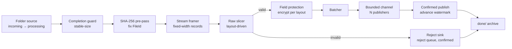

# BatchFileProcessor

A .NET 8 worker service that ingests large, sequential **fixed-width batch files** and publishes their
records to upstream systems as confirmed messages. Parsing and field mapping are **entirely layout-driven**
— swap the layout YAML and you have a new fixed-width format, with zero code changes. The engine is a
generic **raw slicer**: it slices each field's bytes and ships them with their field name; it does not
interpret values (types, scale, sign, dates are the consumer's concern), so it is domain-agnostic. An
example layout is included at [`docs/layouts/g266-v4.8.yaml`](docs/layouts/g266-v4.8.yaml).

## What it guarantees

- **At-least-once delivery.** A batch's watermark advances only *after* the broker confirms the publish, so
  an interrupted run resumes the contiguous confirmed prefix — a record is never lost.
- **Every line is processed or rejected.** A structurally valid record is published; a record that fails
  field validation is encrypted and routed to the reject queue. A single bad line never fails the batch. A
  file is archived to `done/` only after every line has been delivered-or-rejected.
- **Deterministic, dedup-friendly identity.** Each message carries a content-derived id
  (`{FileId}-{BatchSeq}` for batches, `{FileId}-{RecordSeq}-reject` for rejects, where `FileId` is the
  file's SHA-256). It is stamped onto the transport envelope as a deterministic `MessageId`, so a replay
  carries the same id and brokers / consumers can deduplicate it. Delivery is *at-least-once*; combined with
  an idempotent consumer this is **effectively-once**.
- **Field-level protection from the layout.** Fields flagged `encrypt: true` are encrypted (AES-256-GCM,
  self-describing envelope) before publish; a rejected record's raw content is encrypted too, so a marked
  field never travels in clear.
- **Per-profile isolation.** One worker + pipeline is built per profile and run concurrently, so a backlog
  or a slow file in one folder does not stall another's processing. (The broker connection, checkpoint
  store, and host resources are shared.)
- **Fail-closed.** Missing config or an unknown format/transport fails fast at **startup** — the host will
  not run on ambiguous config. At **runtime**, a structural fault or an exhausted publish retry quarantines
  the affected file to `failed/` with its watermark preserved for a clean re-drive, never proceeding on
  ambiguous state.

> Completeness reconciliation (e.g. trailer control totals) and duplicate suppression are **downstream**
> responsibilities: the trailer record is published like any other with its raw counts, and every message
> carries a deterministic dedup key. The engine deliberately performs no value interpretation.

## Pipeline



Memory is O(1) in file size (records stream through a bounded buffer), so multi-gigabyte files are handled
sequentially. Publishing is fan-out across N confirmed publishers; the watermark only advances across the
contiguous confirmed prefix.

## Projects

Variability axes (source / format / transport / checkpoint) sit behind ports wired only at the host;
single-implementation support libraries are concrete references (no speculative ports).

| Project | Responsibility |
|---|---|
| `Common.FileIngestion.Abstractions` | Ports (`IFileSource`, `IRecordParser`, `ICheckpointStore`, `ICompletionGuard`) + primitives |
| `Common.FileIngestion.Layouts` | Layout model + YAML loader (fields, `encrypt`/`required`/`skip`, discriminator, tiling) |
| `Common.FileIngestion.Reading` | Stream framer + single-pass SHA-256 (`FileId`) |
| `Common.FileIngestion.Parsing` | `FixedLengthRecordParser` — the raw slicer |
| `Common.FileIngestion.Protection` | Record protector (field + payload encryption) |
| `Common.FileIngestion.Sources.Folder` | Folder file source + stable-size completion guard |
| `Common.FileIngestion.Checkpointing` | File-based watermark store (same-volume resume) |
| `Common.FileIngestion.Checkpointing.Redis` | Redis watermark store (cross-instance resume) |
| `Common.FileIngestion.Telemetry` | Ingestion metrics + tracing |
| `Common.FileIngestion` | The engine: pipeline, batching, lineage, health, rejecting |
| `Common.Messaging.Contracts` | Message contracts + `IMessagePublisher` port |
| `Common.Messaging.MassTransit` | MassTransit adapter, send-retry, deterministic envelope ids |
| `Common.Security.DataProtection` | AES-256-GCM crypto, field/payload protectors, key providers |
| `Common.Observability` | OpenTelemetry wiring, run/correlation context |
| `Ingestion.Worker` | Composition root: loads profiles, builds one worker + pipeline per profile |

Each `src` project has a matching mocked-unit-test project under `tests/`.

## Configuration — three layers, three owners

| Layer | Owns | Example |
|---|---|---|
| **Layout YAML** | Parsing & mapping only (record types, fields, `encrypt`/`required`/`skip`) | [`docs/layouts/g266-v4.8.yaml`](docs/layouts/g266-v4.8.yaml) |
| **`profiles.yaml`** | Operational routing (folders → layout/format/completion/destinations/batch limits); one profile = one concurrent worker | [`docs/profiles.yaml`](docs/profiles.yaml) |
| **`appsettings` / Helm / Key Vault** | Shared infra & **secrets** (broker + checkpoint connection strings, tuning, observability) | `src/Ingestion.Worker/appsettings.json` |

Broker and checkpoint connection strings live in `appsettings`/Key Vault and **never** in `profiles.yaml`.
Adding a folder/format is a `profiles.yaml` edit; a new fixed-width format is a layout YAML edit — both
zero-code.

**Currently supported:** fixed-length format, RabbitMQ transport, File/Redis checkpoint, stable-size
completion. Delimited parsing and other transports (Kafka/Azure Service Bus) plug in at their existing
seams when a concrete case arrives.

## Build, test, run

```bash
# Build
dotnet build BatchProcessing.sln

# Test (mocked unit tests + 90% line-coverage gate per project)
dotnet test BatchProcessing.sln

# Run the worker (expects config + a reachable broker/checkpoint)
dotnet run --project src/Ingestion.Worker
```

The worker exposes `GET /health/live` (heartbeat staleness) and `GET /health/ready` (publish-outcome gate).
The default `appsettings.json` uses container paths (`/config`, `/data`); point `Ingestion:ProfilesPath`,
the profile folders, and the layout path at local directories for a local run.

## Quality gates & conventions

- **Central Package Management** — versions in `Directory.Packages.props`; shared settings in
  `Directory.Build.props`: `net8.0`, nullable + implicit usings, `TreatWarningsAsErrors`, .NET analyzers
  (`latest-recommended`), NuGet audit (direct + transitive), deterministic builds — a violation fails
  `dotnet build`.
- **Coverage** — 90% line coverage per test project (Coverlet threshold), enforced on `dotnet test`.
- **Static analysis** — developed against a SonarQube gate (zero new issues on changed code), run locally.
  **No CI pipeline is committed in this repo**; the build- and coverage-gates above run via `dotnet build`
  and `dotnet test`.
- **Testing model** — committed tests are **mocked unit tests** only (they carry the coverage gate).
  Integration tests run locally against **real** infrastructure and are **never committed**.
- **Test data is never committed** — sample production-shaped files stay local (see `.gitignore`).

## Design reference

See [`docs/stage1-ingestion-design.md`](docs/stage1-ingestion-design.md) for the full design rationale —
boundary and non-negotiables, the generic ingestion model and variability seams, memory/scale invariants,
delivery guarantees and resilience, security/field protection, component decomposition, and test strategy.
